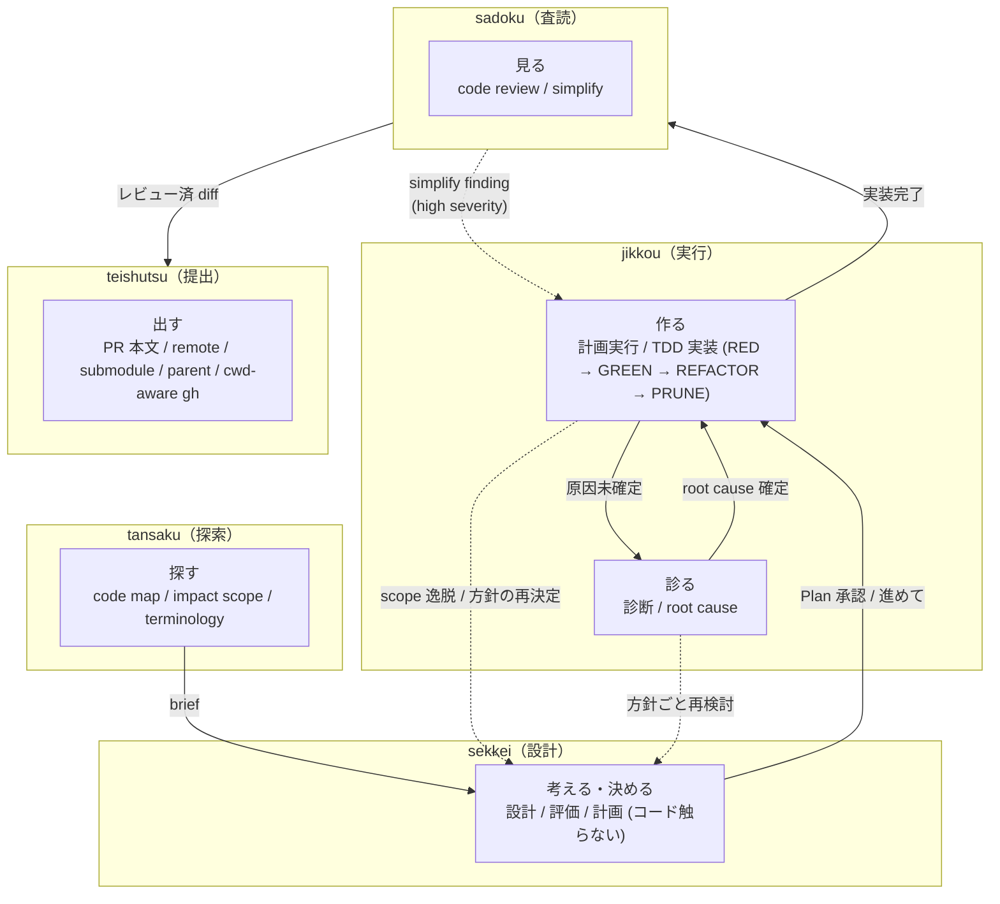

# Skill ワークフロー

> **目的:** skill の境界・起動トリガー・handoff を 1 箇所で確認できるようにする。
>
> **対象範囲:** 実装パイプラインの 5 skill (`tansaku` / `sekkei` / `jikkou` / `sadoku` / `teishutsu`)。文章作成の `shippitsu` はこの pipeline から独立して動く (起動語は下の生成トリガー表に含む、詳細は `../skills/shippitsu/SKILL.md`)。個別の手順・mode 定義の正本は各 `SKILL.md`。本書はその転記をしない。

---

## 1. 役割境界

動詞単位で責務を分割する。`tansaku` は情報取得 / 構造把握 / 用語整理を扱う。`sekkei` は controller として設計 / 計画 / 評価を決める (コードは触らない)。承認後の `jikkou` が計画実行 / 原因診断 / TDD 実装を扱い、レビュー / 提出は各専門 skill に渡す。TDD 実装層では `jikkou` が vertical behavior slice を切り、TDD 実装モードで 1 slice ごとに RED → GREEN → PRUNE を回す。



---

## 2. 起動トリガーとモード切替

skill 単位の起動トリガー早見表は frontmatter から生成する (下記マーカー区間、`scripts/gen-trigger-docs.sh`)。mode 定義の正本は各 `SKILL.md`。

<!-- hikizan:triggers:start -->
<!-- generated by scripts/gen-trigger-docs.sh from skills/*/SKILL.md frontmatter — do not edit by hand -->

| skill | 起動トリガー |
|---|---|
| `tansaku` | 探索, 全体像把握, 影響範囲調査, 用語整理 |
| `sadoku` | PR確認, レビュー, code review, プロジェクトレビュー, コード整理, simplify |
| `sekkei` | 設計判断, 方針決め, design decision, kill or keep, 計画立案 |
| `jikkou` | 計画実行, 実装, エラー診断, root cause, バグ修正 |
| `teishutsu` | PR提出, PR出す, PR ready, PR文書いて, PR description, submission, PR open |
| `shippitsu` | 執筆, 推敲, リライト, 文章を書く |

各 skill の mode 別トリガーと遷移は `docs/workflow.md`、発動条件の正本は各 SKILL.md frontmatter `description`。
<!-- hikizan:triggers:end -->

mode 別の起動トリガーと手順は各 `SKILL.md` の「モード表」が正本 (上の生成表は skill 単位の起動語)。ここで二重管理しない。TDD 実装の必須 / skip レイヤー判定は `../skills/jikkou/references/tdd.md` を参照。

> **状態トリガー** (git diff 検出・計画実行の完了報告直後など) の詳細は各 `SKILL.md` を参照。reviewer コメント対応は skill mode 化しない (通常会話で「返信書いて」)。

### 起動経路は 3 層ある (運用実態)

trigger 表は「どう呼ばれうるか」の定義。実際の起動経路は skill ごとに偏りがあり、これは設計どおり:

| 経路 | 主な skill | 意味 |
|---|---|---|
| 会話内の自動ルーティング | `sekkei` / `jikkou` / `sadoku` / `teishutsu` | ユーザの発話・セッション状態から発火する主動線 |
| エージェント実行 (goal コマンド / VM など) | `jikkou` (TDD 実装モード) | 自律実行の中で TDD 実装層として使われる。ローカルの metrics には残らない |
| ユーザの明示起動 + `sekkei` からの handoff | `tansaku` | 実装前にユーザが全体像を掴みたいとき、または sekkei が判断前の情報不足で差し戻すとき (§3)。会話の自動ルーティングでの発火が少ないのは正常 |

`~/.hikizan/metrics.jsonl` が観測できるのはこのマシンの会話セッションだけ。起動回数の多寡だけで skill の要否を判断しない。

---

## 3. skill 間 handoff 表

「誰から誰へ」「きっかけ」「渡すもの」の一覧。

| from                 | to                     | きっかけ                    | 何を渡す              |
| -------------------- | ---------------------- | --------------------------- | --------------------- |
| (user)               | tansaku 探索          | 「探索して」「全体像を掴んで」 | 対象 file / dir / issue |
| tansaku 探索         | subagent (探索 scout)  | 独立領域が 3 つ以上          | sub-question + 対象範囲 |
| subagent             | tansaku                | 探索完了                    | digest（要裏取り・統合）|
| tansaku 探索         | sekkei 通常検討        | 設計判断に進める              | Map + Terminology + Unknowns + Evidence |
| sekkei 通常検討      | tansaku 探索          | 判断前の情報不足              | 要望 / 対象 file / 既知 evidence |
| (user)               | sekkei 通常検討        | 「設計どうする」            | issue + DoD / tansaku brief |
| (user)               | sekkei 軽量検討        | 「どうやって直す」          | 修正対象              |
| (user)               | sekkei 評価            | 「やる価値ある」            | 判断対象              |
| (user)               | jikkou 診断       | 「エラー」「動かない」      | バグ症状              |
| sekkei 通常検討      | jikkou 計画実行        | Plan 承認 / 「進めて」      | owner skill 付き Plan steps |
| jikkou 計画実行      | sekkei 通常検討        | scope 逸脱 / 方針の再決定   | 逸脱点 + 再検討したい判断 |
| jikkou 計画実行      | jikkou 診断       | 原因未確定 / test failure   | 症状 + evidence |
| jikkou 診断     | jikkou 計画実行        | root cause 確定             | root cause 1 文 + fix 候補 |
| jikkou 計画実行      | sadoku 通常レビュー    | 実装完了                    | handoff + 報告 + 完成 diff |
| (user)               | sadoku 通常レビュー    | 「レビューして」            | diff                  |
| sadoku 通常レビュー  | subagent (reviewer-*)  | Standard 以上 + 専門観点該当 | diff + 範囲           |
| subagent             | sadoku                 | 評価完了                    | findings（要裏取り）  |
| (user)               | sadoku simplify findings | 「整理して」「simplify」(明示) | diff (範囲)        |
| sadoku simplify findings | jikkou 計画実行    | simplify finding (high)     | 対象 finding + file:line |
| (user)               | teishutsu              | 「PR出す」「PR提出」        | 実装完了 + diff       |
| jikkou 計画実行      | teishutsu              | 完了報告 + 本文準備済       | files changed + body  |
| (user)               | teishutsu              | 「PR文書いて」              | change intent + files + verification |

handoff の共通形 (1 行):

```text
handoff: [skill] / brief: [1 文] / evidence: [file:line かコマンド出力]
```

---

## 4. Goal loop で使う場合

Claude Code / Codex などの runtime が `/goal` 相当の継続実行機能を持つ場合、hikizan は loop engine ではなく loop 内の判断規約として使う。hikizan の skill / hook は次 turn を自動発火しない。skill 間の受け渡しは §3 の handoff 表のとおり。

Example goal:

```text
この issue を完了まで進める。未知領域や用語ズレがあれば `tansaku`、設計・計画は `sekkei`、承認後の実行 controller は `jikkou`、TDD 実装は `jikkou` の TDD 実装モード、実装後レビューは `sadoku`、提出は `teishutsu` に渡す。各 step で検証ログを残し、失敗時は `jikkou 診断` に戻る。
```

---

## 5. 検証ログの原則

各 skill が報告に残す検証ログの必須項目は、該当 `SKILL.md` の「報告 (穴埋め)」テンプレが正本 (ここで再掲しない)。共通の原則は 1 つ:

**不可:** self-report だけ（「pass しました」「直りました」等）。機械的に検証できる項目は command 実行結果をそのまま引用する (設計原則「評価は環境変化で見る」、どの tier でも省略しない)。

hook の発火条件と既知の限界は `../hooks/conditions.md` (SoT)、検証の単一入口は `bash scripts/check-all.sh`。

---

*Cursor のプレビューで Mermaid が描画されないときは、拡張機能「Markdown Preview Mermaid Support」等を使う。*
