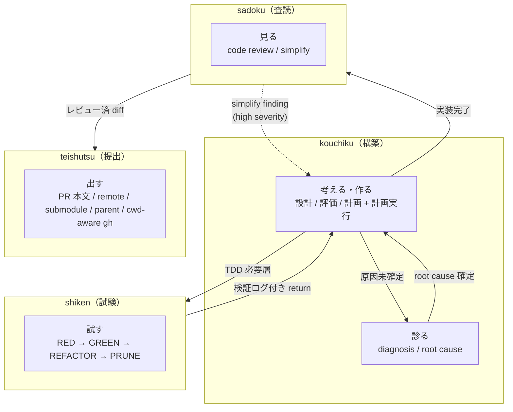
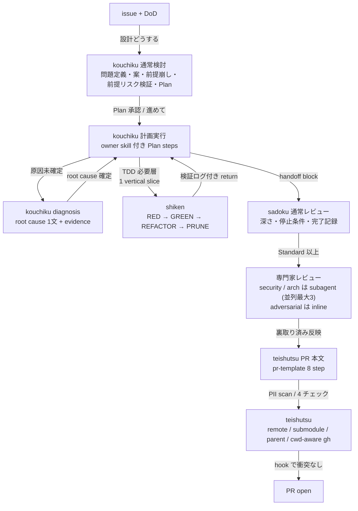
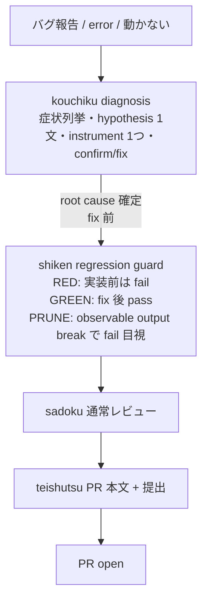
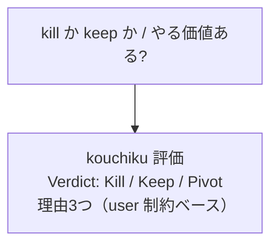
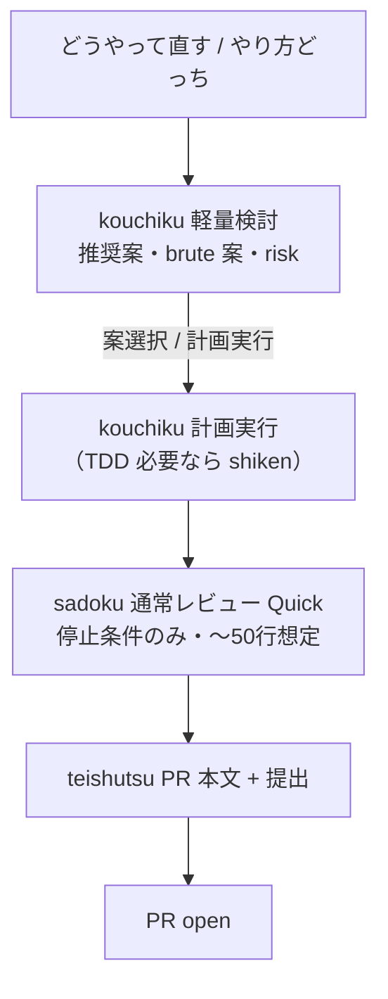
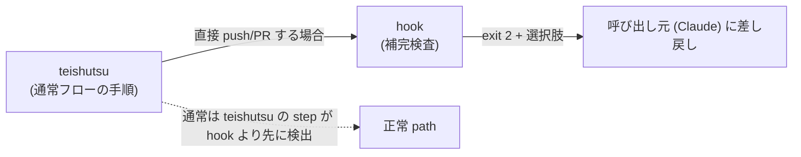

# Skill ワークフロー例

> **目的:** 入力例に対する skill の起動条件と遷移を確認できるようにする。

---

## 目次

1. [役割境界](#1-役割境界)
2. [典型ワークフロー A: 新機能実装](#2-典型ワークフロー-a-新機能実装)
3. [典型ワークフロー B: バグ修正](#3-典型ワークフロー-b-バグ修正)
4. [典型ワークフロー C: 設計判断のみ](#4-典型ワークフロー-c-設計判断のみ)
5. [典型ワークフロー D: 小さい修正](#5-典型ワークフロー-d-小さい修正-軽量検討)
6. [各 skill のモード切替](#6-各-skill-のモード切替フロー)
7. [skill 間 handoff 表](#7-skill-間-handoff-表)
8. [hook 検査](#8-hook-検査)
9. [検証ログ要件](#9-各-skill-の検証ログ要件環境変化評価)
10. [参照](#10-参照)

---

## 1. 役割境界

動詞単位で 4 つの責務に分割する。`kouchiku` は controller として設計 / 計画実行 / 原因診断を扱い、TDD / レビュー / 提出は各専門 skill に渡す。TDD 必要層では `kouchiku` が vertical behavior slice を切り、`shiken` は 1 slice ごとに RED → GREEN → PRUNE を実行する。



---

## 2. 典型ワークフロー A: 新機能実装

issue 受領から PR 提出まで。**kouchiku** が controller として計画を管理し、必要な局面で専門 skill に handoff する。



> **補足**
>
> - 原因未確定の調査は **kouchiku diagnosis** として inline で実行する。
> - **kouchiku → shiken → kouchiku** の往復は handoff block で実行する。1 往復は原則 1 vertical behavior slice。
> - **sadoku** は実装完了後に初めて起動（「見る」専門）。
> - **専門家レビュー**は Standard 以上のみ。Quick は停止条件中心。

---

## 3. 典型ワークフロー B: バグ修正

バグ報告から **regression guard** 付き PR まで。



> **補足**
>
> - **kouchiku diagnosis**: hypothesis を 1 文にできるまでコードに触らない discipline。
> - **bugfix** は shiken の**必須**層。再現テストを先行。
> - 「直りました」だけでは完了扱いにしない。**fix 前後の挙動差分をそのまま引用**。

---

## 4. 典型ワークフロー C: 設計判断のみ

判断要求 → verdict。**コード変更は行わない。**



| ルール                         | 内容                                       |
| ------------------------------ | ------------------------------------------ |
| 「保留」は出さない             | 判断回避を避けるため                       |
| 技術的好みだけで決めない       | user 制約を根拠に含める                    |

---

## 5. 典型ワークフロー D: 小さい修正（軽量検討）

**変更対象が概ね 3 ファイル未満**の軽量検討パターン。



---

## 6. 各 skill のモード切替フロー

各 skill の mode は入力トリガーで決まる。mode 定義の正本は各 `SKILL.md`、下表はその一覧。

| skill | mode / 遷移先 | 入力トリガーの例 |
|---|---|---|
| sadoku | 通常レビュー | 「レビューして」 |
| sadoku | simplify findings | 「整理して」「simplify」「スリム化したい」 |
| sadoku | 通常レビュー → simplify (compound) | 「コードレビュー」 |
| kouchiku | 軽量検討 | 「どうやって直す」「やり方どっち」 |
| kouchiku | 通常検討 | 「設計どうする」「方針決めたい」「アーキテクチャ判断」 |
| kouchiku | 評価 | 「やる価値ある」「採用すべきか」「kill か keep」 |
| kouchiku | 計画実行 | 「計画実行」「進めて」「着手」「実装開始」 |
| kouchiku | diagnosis | 「エラー」「動かない」「落ちる」「クラッシュ」「前は動いてた」「同じ問題が再発」 |
| shiken | 起動 | 「TDDで」「テストから書いて」 |
| teishutsu | PR 本文ドラフト / 提出 | 「PR文書いて」「PR description」「PR出す」「PR提出」「PR ready」「提出して」 |

> **shiken の必須レイヤー**: 純ロジック / API / バグ修正に触れる場合は必須、インタラクションは推奨、純スタイル / アニメ / 文言のみはスキップ可 (理由必須)。`shiken` 直接起動で 1 つの vertical slice に言語化できない場合は `kouchiku` に戻す。
> **状態トリガー** (git diff 検出・計画実行の完了報告直後など) の詳細は各 `SKILL.md` を参照。reviewer コメント対応は skill mode 化しない (通常会話で「返信書いて」)。

---

## 7. skill 間 handoff 表

「誰から誰へ」「きっかけ」「渡すもの」の一覧。

| from                 | to                     | きっかけ                    | 何を渡す              |
| -------------------- | ---------------------- | --------------------------- | --------------------- |
| (user)               | kouchiku 通常検討      | 「設計どうする」            | issue + DoD           |
| (user)               | kouchiku 軽量検討      | 「どうやって直す」          | 修正対象              |
| (user)               | kouchiku 評価          | 「やる価値ある」            | 判断対象              |
| (user)               | kouchiku diagnosis     | 「エラー」「動かない」      | バグ症状              |
| kouchiku 通常検討    | kouchiku 計画実行      | 「計画実行」「進めて」      | owner skill 付き Plan steps |
| kouchiku 計画実行    | kouchiku diagnosis     | 原因未確定 / test failure   | 症状 + evidence |
| kouchiku diagnosis   | kouchiku 計画実行      | root cause 確定             | root cause 1 文 + fix 候補 |
| kouchiku 計画実行    | shiken                 | TDD 必要層に触れた          | vertical slice + spec / edge case / non-goals |
| kouchiku diagnosis   | shiken                 | bugfix 確定                 | root cause + vertical slice + failing behavior + test target |
| shiken               | kouchiku 計画実行      | サイクル完了                | RED/GREEN/PRUNE log + test level + coverage gap + files changed |
| kouchiku 計画実行    | sadoku 通常レビュー    | 実装完了                    | handoff block + 完成 diff |
| (user)               | sadoku 通常レビュー    | 「レビューして」            | diff                  |
| sadoku 通常レビュー  | subagent (reviewer-*)  | Standard 以上 + 専門観点該当 | diff + 範囲           |
| subagent             | sadoku                 | 評価完了                    | findings（要裏取り）  |
| (user)               | sadoku simplify findings | 「整理して」「simplify」  | diff (範囲)           |
| sadoku 通常レビュー  | sadoku simplify findings | compound (「コードレビュー」) | レビュー後の連結実行 |
| sadoku simplify findings | kouchiku 計画実行  | simplify finding (high)     | 対象 finding + file:line |
| (user)               | teishutsu              | 「PR出す」「PR提出」        | 実装完了 + diff       |
| kouchiku 計画実行    | teishutsu              | 完了報告 + 本文準備済       | files changed + body  |
| (user)               | teishutsu              | 「PR文書いて」              | change intent + files + verification |

handoff block の共通形:

```text
handoff: [skill]
reason: [なぜ今渡すか]
context: [症状 / 仕様 / 設計判断]
evidence:
  - [file:line / command output / logs]
expected return:
  - [戻してほしい成果物]
```

---

## 8. hook 検査

skill 本文は通常フローの手順を示し、hook は skill を経由しない操作に対する補完的な検査を行う。実体は `hooks/hooks.json` と `scripts/`。4 つの hook (SessionStart で CLAUDE.md に必要なセクションを重複なく追加、`git push` / `gh pr create` の条件チェック、`git commit` 後の submodule warning) の**発火条件マトリクスは `hooks/conditions.md` を参照** (SoT)。発火イベントは `~/.hikizan/metrics.jsonl` に記録される (`HIKIZAN_METRICS_DIR` で書き込み先変更可)。



詳細: `hooks/conditions.md`。

---

## 9. 各 skill の検証ログ要件（環境変化評価）

| skill     | 検証ログ必須項目                                                 | 形式                    |
| --------- | ---------------------------------------------------------------- | ----------------------- |
| sadoku    | 停止条件 scan / tests / verification / PII scan                  | command + 出力末尾      |
| kouchiku  | （計画実行 / diagnosis のみ）verification / Confirmed（fix 前後の挙動差分） | command + 出力末尾 / そのまま引用 |
| shiken    | RED / GREEN / PRUNE 各 phase、test level、coverage gap、PRUNE witness | test runner 最終行 + return log |
| teishutsu | remote state / submodule / parent commit / push / PR body / cwd at gh / PR | command + 出力 (`pwd` はそのまま引用) |

**不可:** self-report だけ（「pass しました」「直りました」等）。**必ず command 実行結果を引用**。

---

## 10. 参照

| 種別                         | パス                                                                              |
| ---------------------------- | --------------------------------------------------------------------------------- |
| sadoku                       | `../skills/sadoku/SKILL.md`                                                       |
| persona                      | `../skills/sadoku/references/persona-catalog.md`                                  |
| 文脈抽出                     | `../skills/sadoku/references/project-context.md`                                  |
| subagent                     | `../skills/sadoku/references/agents/reviewer-security.md`, `reviewer-architecture.md` |
| kouchiku                     | `../skills/kouchiku/SKILL.md`                                                     |
| kouchiku references          | `../skills/kouchiku/references/minimal-approach.md`, `../skills/kouchiku/references/diagnosis-techniques.md` |
| shiken                       | `../skills/shiken/SKILL.md`, `../skills/shiken/references/testing-anti-patterns.md` |
| teishutsu                    | `../skills/teishutsu/SKILL.md`                                                    |
| PR テンプレ                  | `../skills/teishutsu/references/pr-template.md`                                   |
| hook 設定 / 停止条件マトリクス | `../hooks/conditions.md`, `../hooks/hooks.json`     |
| CLAUDE.md テンプレ           | `../templates/CLAUDE.md`                                                          |

---

*Cursor のプレビューで Mermaid が描画されない場合は、拡張機能「Markdown Preview Mermaid Support」等の利用を検討してください。*
