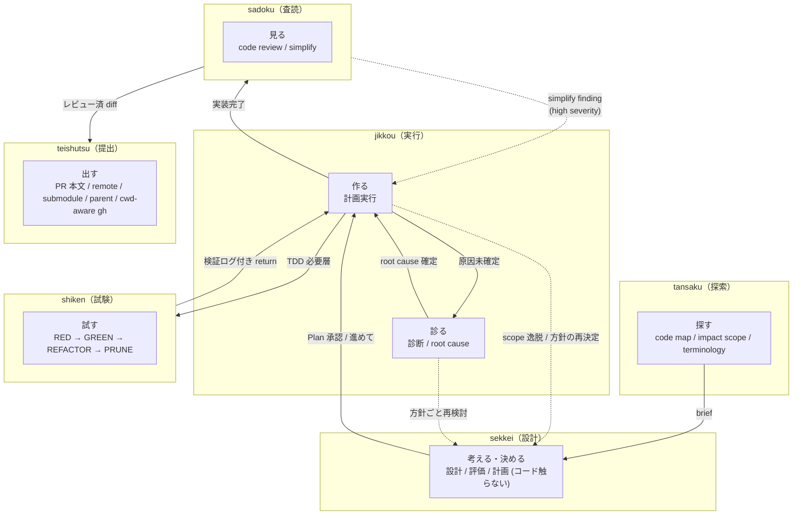
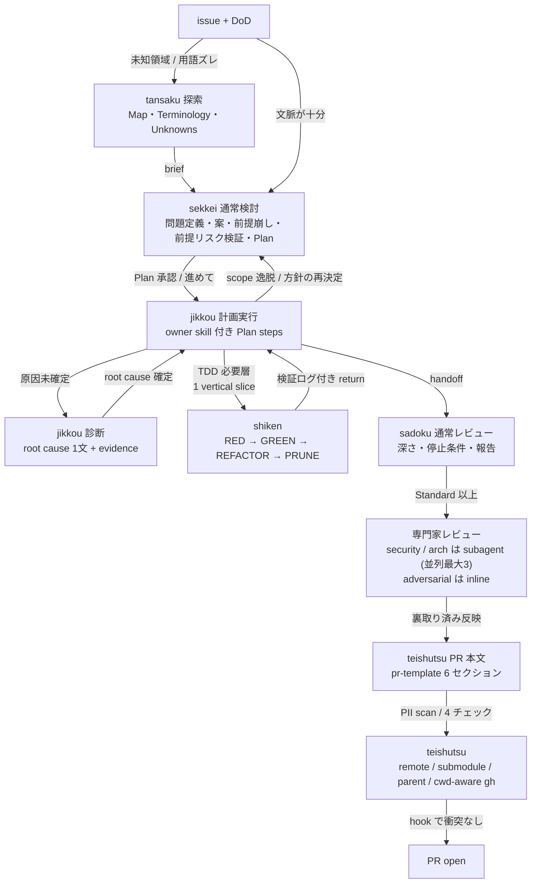
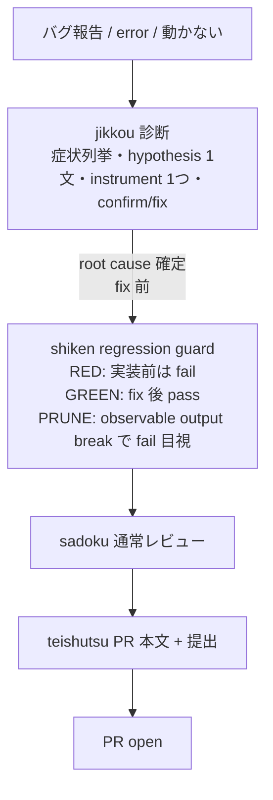
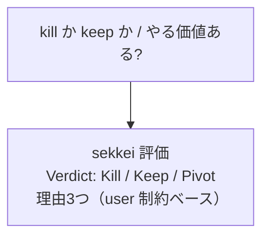
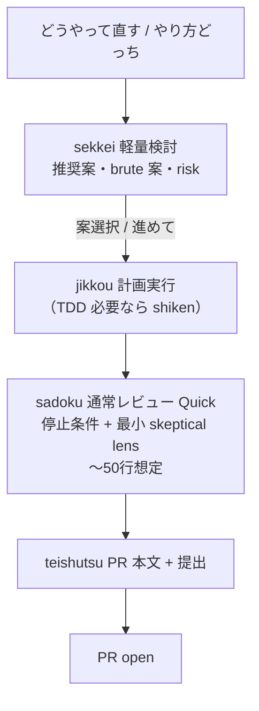
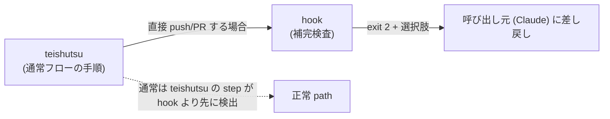

# Skill ワークフロー例

> **目的:** 入力例に対する skill の起動条件と遷移を確認できるようにする。
>
> **対象範囲:** 本書は実装パイプラインの 6 skill (`tansaku` / `sekkei` / `jikkou` / `shiken` / `sadoku` / `teishutsu`) の境界・遷移・handoff を扱う。文章作成の `kaku` はこの pipeline から独立して動くため、以降のフロー図・mode 遷移・handoff 表・検証ログの対象外 (起動語は下の生成トリガー表に含む、詳細は `../skills/kaku/SKILL.md`)。

---

## 目次

1. [役割境界](#1-役割境界)
2. [典型ワークフロー A: 新機能実装](#2-典型ワークフロー-a-新機能実装)
3. [典型ワークフロー B: バグ修正](#3-典型ワークフロー-b-バグ修正)
4. [典型ワークフロー C: 設計判断のみ](#4-典型ワークフロー-c-設計判断のみ)
5. [典型ワークフロー D: 小さい修正](#5-典型ワークフロー-d-小さい修正-軽量検討)
6. [各 skill のモード切替](#6-各-skill-のモード切替フロー)
7. [skill 間 handoff 表](#7-skill-間-handoff-表)
8. [Goal loop で使う場合](#8-goal-loop-で使う場合)
9. [hook 検査](#9-hook-検査)
10. [検証ログ要件](#10-各-skill-の検証ログ要件環境変化評価)
11. [参照](#11-参照)

---

## 1. 役割境界

動詞単位で責務を分割する。`tansaku` は情報取得 / 構造把握 / 用語整理を扱う。`sekkei` は controller として設計 / 計画 / 評価を決める (コードは触らない)。承認後の `jikkou` が計画実行 / 原因診断を扱い、TDD / レビュー / 提出は各専門 skill に渡す。TDD 必要層では `jikkou` が vertical behavior slice を切り、`shiken` は 1 slice ごとに RED → GREEN → PRUNE を実行する。



---

## 2. 典型ワークフロー A: 新機能実装

issue 受領から PR 提出まで。**sekkei** が計画を決め、承認後の **jikkou** が controller として実行を管理し、必要な局面で専門 skill に handoff する。



> **補足**
>
> - 未知領域や用語ズレがある場合は、設計前に **tansaku** で Map / Terminology / Unknowns を作る。
> - **sekkei** はコードを触らず、Plan 承認を境に **jikkou** に handoff する。scope 逸脱や方針の再決定が要るときは jikkou から sekkei に差し戻す。
> - 原因未確定の調査は **jikkou 診断** として inline で実行する。
> - **jikkou → shiken → jikkou** の往復は handoff (+ vertical slice 指定) で実行する。1 往復は原則 1 vertical behavior slice。
> - **sadoku** は実装完了後に初めて起動（「見る」専門）。
> - **専門家レビュー**は Standard 以上のみ。Quick は停止条件 + 最小 skeptical lens 中心。

---

## 3. 典型ワークフロー B: バグ修正

バグ報告から **regression guard** 付き PR まで。



> **補足**
>
> - **jikkou 診断**: hypothesis を 1 文にできるまでコードに触らない discipline。方針ごと考え直す重い分岐なら sekkei に戻す。
> - **bugfix** は shiken の**必須**層。再現テストを先行。
> - 「直りました」だけでは完了扱いにしない。**fix 前後の挙動差分をそのまま引用**。

---

## 4. 典型ワークフロー C: 設計判断のみ

判断要求 → verdict。**コード変更は行わない。**



| ルール                         | 内容                                       |
| ------------------------------ | ------------------------------------------ |
| 「保留」は出さない             | 判断回避を避けるため                       |
| 技術的好みだけで決めない       | user 制約を根拠に含める                    |

---

## 5. 典型ワークフロー D: 小さい修正（軽量検討）

**変更対象が概ね 3 ファイル未満**の軽量検討パターン。



---

## 6. 各 skill のモード切替フロー

各 skill の mode は入力トリガーで決まる。skill 単位の起動トリガー早見表は frontmatter から生成する (下記マーカー区間、`scripts/gen-trigger-docs.sh`)。mode 定義の正本は各 `SKILL.md`。

<!-- hikizan:triggers:start -->
<!-- generated by scripts/gen-trigger-docs.sh from skills/*/SKILL.md frontmatter — do not edit by hand -->

| skill | 起動トリガー |
|---|---|
| `tansaku` | 探索, 全体像把握, 影響範囲調査, 用語整理 |
| `sadoku` | PR確認, レビュー, code review, プロジェクトレビュー, 整理, simplify |
| `sekkei` | 設計判断, 方針決め, design decision, kill or keep, 計画立案 |
| `jikkou` | 計画実行, 実装, エラー診断, root cause, バグ修正 |
| `shiken` | TDD, テスト先行, テストから書く |
| `teishutsu` | PR提出, PR出す, PR ready, PR文書いて, PR description, submission, PR open |
| `kaku` | 執筆, 推敲, リライト, 文章を書く |

各 skill の mode 別トリガーと遷移は `docs/workflow.md`、発動条件の正本は各 SKILL.md frontmatter `description`。
<!-- hikizan:triggers:end -->

mode 別の起動トリガーと手順は各 `SKILL.md` の「モード表」が正本 (上の生成表は skill 単位の起動語、mode 詳細は各 SKILL.md)。ここで二重管理しない。`shiken` の必須 / skip レイヤー判定も `../skills/shiken/SKILL.md` を参照。

> **状態トリガー** (git diff 検出・計画実行の完了報告直後など) の詳細は各 `SKILL.md` を参照。reviewer コメント対応は skill mode 化しない (通常会話で「返信書いて」)。

### 起動経路は 3 層ある (運用実態)

trigger 表は「どう呼ばれうるか」の定義。実際の起動経路は skill ごとに偏りがあり、これは設計どおり:

| 経路 | 主な skill | 意味 |
|---|---|---|
| 会話内の自動ルーティング | `sekkei` / `jikkou` / `sadoku` / `teishutsu` | ユーザの発話・セッション状態から発火する主動線 |
| エージェント実行 (goal コマンド / VM など) | `shiken` | 自律実行の中で TDD 層として使われる。ローカルの metrics には残らない |
| ユーザの明示起動のみ | `tansaku` | 実装に移る前にユーザが全体像を把握したいときだけ呼ぶ。自動発火しないのが正常 |

`~/.hikizan/metrics.jsonl` が観測できるのはこのマシンの会話セッションだけ。起動回数の多寡だけで skill の要否を判断しない。

---

## 7. skill 間 handoff 表

「誰から誰へ」「きっかけ」「渡すもの」の一覧。

| from                 | to                     | きっかけ                    | 何を渡す              |
| -------------------- | ---------------------- | --------------------------- | --------------------- |
| (user)               | tansaku 探索          | 「探索して」「全体像を掴んで」 | 対象 file / dir / issue |
| tansaku 探索         | subagent (探索 scout)  | 独立領域が 3 つ以上          | sub-question + 対象範囲 |
| subagent             | tansaku                | 探索完了                    | digest（要裏取り・統合）|
| tansaku 探索         | sekkei 通常検討        | 設計判断に進める              | Map + Terminology + Unknowns + Evidence |
| sekkei 通常検討      | tansaku 探索          | 判断前の情報不足              | 要望 / 対象 file / 既知 evidence |
| (user)               | sekkei 通常検討        | 「設計どうする」            | issue + DoD / tansaku brief |
| (user)               | sekkei 軽量検討        | 「どうやって直す」          | 修正対象              |
| (user)               | sekkei 評価            | 「やる価値ある」            | 判断対象              |
| (user)               | jikkou 診断       | 「エラー」「動かない」      | バグ症状              |
| sekkei 通常検討      | jikkou 計画実行        | Plan 承認 / 「進めて」      | owner skill 付き Plan steps |
| jikkou 計画実行      | sekkei 通常検討        | scope 逸脱 / 方針の再決定   | 逸脱点 + 再検討したい判断 |
| jikkou 計画実行      | jikkou 診断       | 原因未確定 / test failure   | 症状 + evidence |
| jikkou 診断     | jikkou 計画実行        | root cause 確定             | root cause 1 文 + fix 候補 |
| jikkou 計画実行      | shiken                 | TDD 必要層に触れた          | vertical slice + spec / edge case / non-goals |
| jikkou 診断     | shiken                 | bugfix 確定                 | root cause + vertical slice + failing behavior + test target |
| shiken               | jikkou 計画実行        | サイクル完了                | RED/GREEN/PRUNE log + test level + coverage gap + files changed |
| jikkou 計画実行      | sadoku 通常レビュー    | 実装完了                    | handoff + 報告 + 完成 diff |
| (user)               | sadoku 通常レビュー    | 「レビューして」            | diff                  |
| sadoku 通常レビュー  | subagent (reviewer-*)  | Standard 以上 + 専門観点該当 | diff + 範囲           |
| subagent             | sadoku                 | 評価完了                    | findings（要裏取り）  |
| (user)               | sadoku simplify findings | 「整理して」「simplify」(明示) | diff (範囲)        |
| sadoku simplify findings | jikkou 計画実行    | simplify finding (high)     | 対象 finding + file:line |
| (user)               | teishutsu              | 「PR出す」「PR提出」        | 実装完了 + diff       |
| jikkou 計画実行      | teishutsu              | 完了報告 + 本文準備済       | files changed + body  |
| (user)               | teishutsu              | 「PR文書いて」              | change intent + files + verification |

handoff の共通形 (1 行):

```text
handoff: [skill] / brief: [1 文] / evidence: [file:line かコマンド出力]
```

`jikkou` → `shiken` だけは vertical slice の指定を加える (形式は `skills/jikkou/references/plan-execution.md`)。

---

## 8. Goal loop で使う場合

Claude Code / Codex などの runtime が `/goal` 相当の継続実行機能を持つ場合、hikizan は loop engine ではなく loop 内の判断規約として使う。hikizan の skill / hook は次 turn を自動発火しない。

- 未知領域や用語ズレがあれば `tansaku` で Map / Terminology / Unknowns を作る
- 設計・計画は `sekkei`、承認後の実行は `jikkou` を controller にする
- TDD 必要層は `shiken` に 1 vertical behavior slice だけ渡す
- `shiken` は coverage gap / failure / PRUNE witness を return し、次 slice を自分で増やさない
- 実装完了後は `sadoku` に渡す
- 提出時は `teishutsu` に渡す
- 失敗時は `jikkou 診断` に戻り、root cause を 1 文で固定してから進む

Example goal:

```text
この issue を完了まで進める。未知領域や用語ズレがあれば `tansaku`、設計・計画は `sekkei`、承認後の実行 controller は `jikkou`、TDD 必要層は `shiken`、実装後レビューは `sadoku`、提出は `teishutsu` に渡す。各 step で検証ログを残し、失敗時は `jikkou 診断` に戻る。
```

---

## 9. hook 検査

検証の単一入口は `bash scripts/check-all.sh` (hook tests + consistency lint + trigger 表鮮度)。

skill 本文は通常フローの手順を示し、hook は skill を経由しない操作に対する補完的な検査を行う。実体は `hooks/hooks.json` と `hooks/scripts/`。5 つの hook (SessionStart で routing / safety / tier を context 注入、`git push` の non-ff / 保護 branch force を deny、`rm` / `git reset` / `clean` / `checkout` の不可逆操作を ask、`gh pr create` の draft / reviewer 未指定を deny、`git commit` 後の submodule warning)。決定は公式 JSON `permissionDecision`。**発火条件マトリクスと既知の限界は `hooks/conditions.md` を参照** (SoT)。決定論ロジックは `hooks/tests/` で回帰検査。発火イベントは `~/.hikizan/metrics.jsonl` に記録される (`HIKIZAN_METRICS_DIR` で書き込み先変更可)。



詳細: `hooks/conditions.md`。

---

## 10. 各 skill の検証ログ要件（環境変化評価）

各 skill が報告に残す検証ログの必須項目は、該当 `SKILL.md` の「報告 (穴埋め)」テンプレが正本 (ここで再掲しない)。共通の原則は 1 つ:

**不可:** self-report だけ（「pass しました」「直りました」等）。機械的に検証できる項目は command 実行結果をそのまま引用する (設計原則「評価は環境変化で見る」、どの tier でも省略しない)。

---

## 11. 参照

| 種別                         | パス                                                                              |
| ---------------------------- | --------------------------------------------------------------------------------- |
| tansaku                     | `../skills/tansaku/SKILL.md`                                                     |
| CONTEXT.md 契約              | `../skills/tansaku/references/context-doc.md`                                     |
| tansaku fan-out              | `../skills/tansaku/references/fanout.md`                                          |
| sadoku                       | `../skills/sadoku/SKILL.md`                                                       |
| persona                      | `../skills/sadoku/references/persona-catalog.md`                                  |
| 文脈抽出                     | `../skills/sadoku/references/project-context.md`                                  |
| subagent                     | `../skills/sadoku/references/agents/reviewer-security.md`, `reviewer-architecture.md` |
| sekkei                       | `../skills/sekkei/SKILL.md`                                                       |
| sekkei references            | `../skills/sekkei/references/deliberation.md`, `../skills/sekkei/references/minimal-approach.md` |
| jikkou                       | `../skills/jikkou/SKILL.md`                                                       |
| jikkou references            | `../skills/jikkou/references/plan-execution.md`, `../skills/jikkou/references/diagnosis-techniques.md` |
| shiken                       | `../skills/shiken/SKILL.md`, `../skills/shiken/references/testing-anti-patterns.md` |
| teishutsu                    | `../skills/teishutsu/SKILL.md`                                                    |
| PR テンプレ                  | `../skills/teishutsu/references/pr-template.md`                                   |
| hook 設定 / 停止条件マトリクス | `../hooks/conditions.md`, `../hooks/hooks.json`     |
| CLAUDE.md テンプレ           | `../templates/CLAUDE.md`                                                          |

---

*Cursor のプレビューで Mermaid が描画されない場合は、拡張機能「Markdown Preview Mermaid Support」等の利用を検討してください。*
