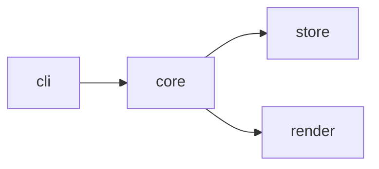

# mermaid で構造を見せる

tansaku の報告で構造を伝えるとき、文章で追わせるより mermaid を 1 枚添える。原則「認知負荷の削減」の「構造変更は図」を具体化したもの。意味は mermaid のテキストに固定され、diff も取れる。

## どの図を使うか

| 見せたいもの | mermaid 種別 |
| --- | --- |
| モジュール / ファイルの依存 | `flowchart LR` |
| 制御フロー / 分岐 | `flowchart TD` |
| コンポーネント間のやり取り / 時系列 | `sequenceDiagram` |
| データモデル / 型の関係 | `classDiagram` |

## 最小例 (依存)

## 注意

- mermaid は GitHub / Markdown ビューアでは描画されるが、素のターミナルでは描画されない。報告が PR / docs に着地する前提で使う。
- 1 枚で追えないほど複雑なら、図を分けるより対象を絞る。tansaku は全体像、詳細は `kouchiku` に渡す。
- ノードのラベルは実在の symbol / path にする。架空の構造を描かない (事実は file:line)。
